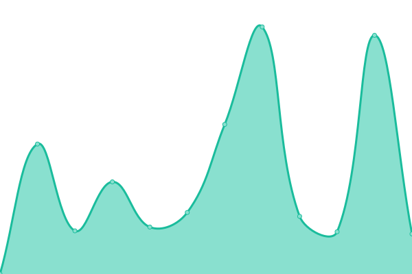

# [📈 Live Status](https://juan81mg.github.io/status_crjp): <!--live status--> **🟧 Partial outage**

This repository contains the open-source uptime monitor and status page for [Juan Manuel Gil](https://juan81mg.github.io/status_crjp), powered by [Upptime](https://github.com/upptime/upptime).

With [Upptime](https://upptime.js.org), you can get your own unlimited and free uptime monitor and status page, powered entirely by a GitHub repository. We use [Issues](https://github.com/juan81mg/status_crjp/issues) as incident reports, [Actions](https://github.com/juan81mg/status_crjp/actions) as uptime monitors, and [Pages](https://juan81mg.github.io/status_crjp) for the status page.

<!--start: status pages-->
<!-- This summary is generated by Upptime (https://github.com/upptime/upptime) -->
<!-- Do not edit this manually, your changes will be overwritten -->
<!-- prettier-ignore -->
| URL | Status | History | Response Time | Uptime |
| --- | ------ | ------- | ------------- | ------ |
|  [Caja Web](https://cajapolicia.gob.ar) | 🟥 Down | [caja-web.yml](https://github.com/juan81mg/status_crjp/commits/HEAD/history/caja-web.yml) | 

 0ms
     
 | 

<a href="https://juan81mg.github.io/status_crjp/history/caja-web">100.00%</a>
    

|  [Caja Mail](https://mail.cajapolicia.gob.ar) | 🟩 Up | [caja-mail.yml](https://github.com/juan81mg/status_crjp/commits/HEAD/history/caja-mail.yml) | 

 2252ms
     
 | 

<a href="https://juan81mg.github.io/status_crjp/history/caja-mail">99.70%</a>
    

|  [Caja Cloud](https://cloud.cajapolicia.gob.ar) | 🟥 Down | [caja-cloud.yml](https://github.com/juan81mg/status_crjp/commits/HEAD/history/caja-cloud.yml) | 

 0ms
     
 | 

<a href="https://juan81mg.github.io/status_crjp/history/caja-cloud">100.00%</a>
    

|  [Gedeba](https://cas.gdeba.gba.gob.ar) | 🟥 Down | [gedeba.yml](https://github.com/juan81mg/status_crjp/commits/HEAD/history/gedeba.yml) | 

 4451ms
     
 | 

<a href="https://juan81mg.github.io/status_crjp/history/gedeba">99.49%</a>
    

<!--end: status pages-->

[**Visit our status website →**](https://juan81mg.github.io/status_crjp)

## 📄 License

- Powered by: [Upptime](https://github.com/upptime/upptime)
- Code: [MIT](./LICENSE) © [Juan Manuel Gil](https://juan81mg.github.io/status_crjp)
- Data in the `./history` directory: [Open Database License](https://opendatacommons.org/licenses/odbl/1-0/)
